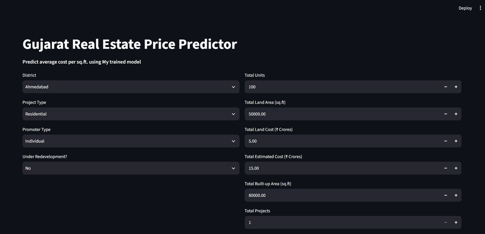

# Gujarat Real Estate Price Predictor

An end-to-end Machine Learning project that predicts the **average cost per square foot** of residential and commercial properties in Gujarat using official RERA data.

Built with Python, Scikit-learn, and Streamlit.

## What it does
Predicts realistic property prices (₹ per sq.ft) based on project details, location, construction scale, and development costs. Includes data cleaning, EDA, model training, and a live interactive web app.

**Key Highlights**:
- Trained on cleaned Gujarat RERA filings
- Used **Gradient Boosting Regressor** with Log Transformation
- Achieved strong performance with **Test MAE ≈ ₹1,005 per sq.ft**
- Interactive Streamlit web application

## Dataset Used
- **Source**: Official Gujarat RERA Project Data
- **Raw Records**: Thousands of registered real estate projects
- **Key Features**: District, Project Type, Land Area, Built-up Area, Development Cost, Land Cost, etc.
- **Target Variable**: `avgCostPerSqFt` (₹ per square foot)

## Tech Stack
- **Programming**: Python, Jupyter Notebook
- **Data Analysis**: Pandas, NumPy, Matplotlib, Seaborn
- **Machine Learning**: Scikit-learn (Gradient Boosting)
- **Deployment**: Streamlit
- **Others**: Joblib, Ordinal Encoding, Log Transformation

## Key Insights from the Model

### 1. The Big Drivers: Structure and Execution Cost (~63%)
The top three features combined dictate nearly **63%** of the model’s decisions:
- `totalDevelopCost` (23.3%)
- `AvgSquareFootBuild` (20.0%)
- `totalSquareFootBuild` (19.3%)

**Insight**: The model heavily relies on **construction scale and density**. High-density or luxury projects with significant material and execution costs naturally command higher per sq.ft rates.

### 2. Capital vs. Land Value (~31%)
- `totalLandCost` (11.8%)
- `totalEstimatedCost` (10.0%)
- `avgEstimatedCost_AllProjects` (9.2%)

**Insight**: `totalLandCost` acts as a strong **implicit location signal**. Expensive land in prime areas (like Ahmedabad or Surat) significantly increases predicted prices.

### 3. What the Model Smartly Ignores
Features like `totalSellingAmount`, `totalUnits`, and `avgUnits` have very low importance. This shows the model is **not cheating** by looking at final revenue — it focuses on **engineering and cost fundamentals**.

## Model Performance
| Model                    | Test MAE (₹/sq.ft) | Test RMSE     | R² Score |
|--------------------------|--------------------|---------------|----------|
| Gradient Boosting (Tuned)| **₹1,009**         | **₹609**      | 99.72%   |
| Random Forest            | Higher             | Higher        | Good     |

**Best Model**: Gradient Boosting Regressor with Log Transformation

## Live Demo
**Live Web App**: [Gujarat Property Price Predictor](https://your-streamlit-link.streamlit.app)  

  
